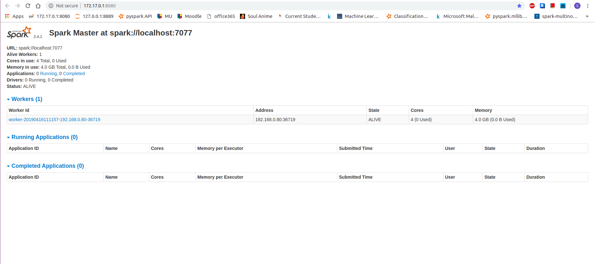
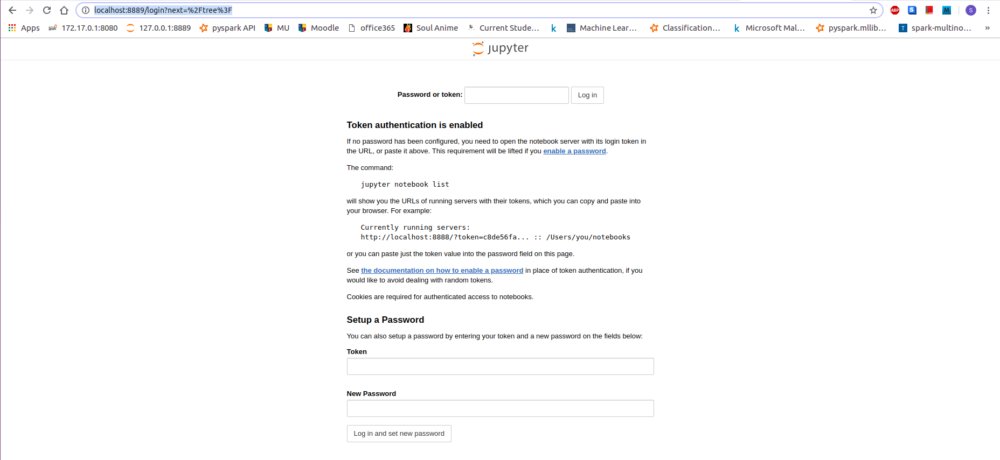

Docker Image for Data Science
-----------------------

This Docker sets up a Jupyter-Spark Notebook with all the dependencies

With Docker Compose
```bash
docker-compose  up --build
```

Without Docker Compose
```bash
docker build --tag='spark_stack' .
```

```bash
docker run -it --net=host -v /home/:/home/   spark_stack
```

Spark Master at : spark://localhost:7777

Spark Master UI at : http://localhost:8080





Jupyter Notebook at : http://localhost:8889

